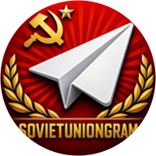

# SovietGram

**Клиент Telegram в советской эстетике — и с кучей функций, которых в оригинале нет.**

[-e63946?style=for-the-badge)](https://t.me/SovietUnionGram)

---

## Что это

Форк [NagramX](https://github.com/risin42/NagramX), который форк [Nagram](https://github.com/NextAlone/Nagram), который происходит от [Nekogram](https://github.com/Nekogram/Nekogram) и, в основании, от [Telegram для Android](https://github.com/DrKLO/Telegram).

Сборки выкладываются в **[@SovietUnionGram](https://t.me/SovietUnionGram)**.

---

## Благодарности

SovietGram стоит на чужой работе, и список длинный:

- [Telegram для Android](https://github.com/DrKLO/Telegram)
- [Nekogram](https://github.com/Nekogram/Nekogram)
- [Nagram](https://github.com/NextAlone/Nagram)
- [NagramX](https://github.com/risin42/NagramX)
- [AyuGram](https://github.com/AyuGram)
- [exteraGram](https://github.com/exteraSquad)
- [NagramXTurbo](https://github.com/temporaryna/NagramXTurbo)

### Плагины

Отдельное спасибо авторам плагинов для exteraGram:

<table>
<tr>
<td><a href="https://t.me/gehirnfull">@gehirnfull</a></td>
<td><a href="https://t.me/kotovprojects">@kotovprojects</a></td>
<td><a href="https://t.me/mishabotov">@mishabotov</a></td>
</tr>
<tr>
<td><a href="https://t.me/PESSDES_Plugins">@PESSDES_Plugins</a></td>
<td><a href="https://t.me/binbash_0">@binbash_0</a></td>
<td><a href="https://t.me/itskotovski">@itskotovski</a></td>
</tr>
<tr>
<td><a href="https://t.me/tiptop_super7">@tiptop_super7</a></td>
<td><a href="https://t.me/amovdev">@amovdev</a></td>
<td><a href="https://t.me/RoflPlugins">@RoflPlugins</a></td>
</tr>
<tr>
<td><a href="https://t.me/swagnonher">@swagnonher</a></td>
<td><a href="https://t.me/tapesix">@tapesix</a></td>
<td></td>
</tr>
</table>

Иконки взяты из [@exteraIcons](https://t.me/exteraIcons).

Спасибо каждому. Если чей-то канал сюда не попал, а стоило — напишите в [@SovietUnionGram](https://t.me/SovietUnionGram), добавлю.

---

## Лицензия

[GNU General Public License v3.0](LICENSE).

Исходный код Telegram распространяется под GPL-2.0-or-later; проект целиком — под GPL-3.0. Форкаете — оставляйте открытым.

  

**Если SovietGram вам пригодился — звезда ничего не стоит, а помогает сильно.**

 

Не связан с Telegram FZ-LLC.

